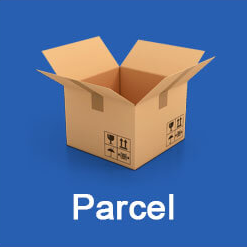

<h1> Hi, I'm Bohdan 👋 </h1>
<ul>
  <li> <h3>🔭 I’m currently working <b> on Projects</h3> </b> </li>
  <li> <h3>👀 I’m interested in  <b> everything about Front-end</h3> </b> </li>
<!--   <li> <h3>🌱 I’m currently learning  <b> JavaScript</h3> </b> </li> -->
</ul>

<h1>3>y stack </h1>

   
   
   
  
  
  
  
  
  
  

