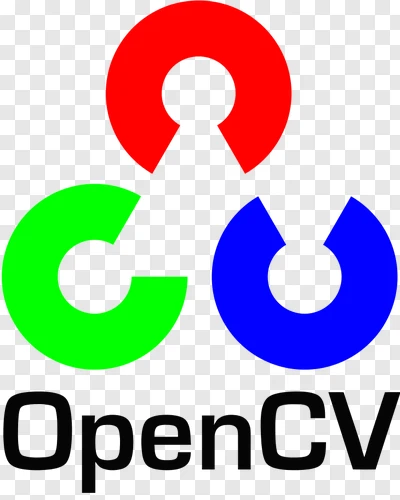

<h1 align="center"><b>So... What «should» I write here?🎴</b></h1>

###

  

###

  <h3>What do I do?</h3>
  

    • OSS Contributor  
    • OSHW Contributor  
    • Building own projects  
    • Growing in engineering, robotics, UAVs
  

   

  <h3>Want to collaborate 🎎? Have any suggestions? Write to me 🫠</h3>

###

  <h3>My stack</h3>

  

    
    
    
    
    
    
  

  ###

  
Statistics will be posted here someday. But when? ㊙️

